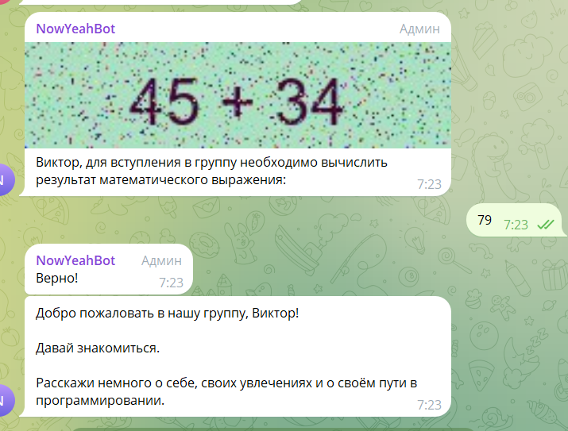

# Бот для Telegram-канала "[Код на салфетке](https://t.me/press_any_button)" и чата "[Кот на салфетке](https://t.me/pressanybutton_chat)"

## О репозитории
Репозиторий с исходным кодом бота для конкурса начинающих программистов на Python

## Задача
У нас есть "Бот на салфетке" - бот для канала и чата. В связи с большим количеством спамеров, приходящих в чат и
спамящих своим "очень интересным предложением", возникла необходимость в защите - введением проверки новых пользователей
чата через "капчу", при правильном ответе на которую пользователь может продолжить общаться, в противном случае бот
исключает его из чата.

Способов решения задачи несколько, от чего она является идеальной для конкурса.

### Необходимо:
1. Реализовать "капчу" для нового участника чата.
2. "Капча" должна быть в виде изображения.
3. Для упрощения, достаточно реализовать задачу на сложение, результат которой будет проверять бот.
4. Дать пользователю три попытки на решение задачи.
5. Если пользователь три раза вводит неверный ответ - исключение из чата.
6. Все сообщения пользователя без верного ответа - удалять.
7. (Опционально) Добавить таймер в течении которого пользователь должен ответить верно (включая неверные ответы), если
   не было верного ответа или не было сообщений вовсе - исключение.

## Что было сделано?
1. Был добавлен генератор капчи (./botlogic/utils/capcha_gen.py) который генерирует пример и ответ на него. Требуется библиотека Pillow
2. Был добавлен класс состояний для ответа пользователя на капчу (в statesform.py)
3. Добавлены хендлеры для задания капчи и сбора ответов (./botlogic/handlers/capcha_fsm.py)
4. В main.py добавлены точки для хендлеров
5. Добавлено ограничение по времени.
В итоге получился не отдельный бот, а новая фича для существующего.

## Как участвовать?
1. Необходимо сделать fork (именно fork, а не clone!) проекта. 
2. Написать функционал антиспама в отдельной ветке.
3. Убедиться, что всё работает.
4. Сделать push в свой репозиторий и из него pull request в наш.
5. Ждать начала голосования и участвовать в обсуждении своего и решений других участников.

## Используемые библиотеки
- aiogram 3
- pydantic-settings
- requests

## Запуск
1. Создать и активировать виртуальное окружение:
   ```bash
   python -m venv .venv

   # для Windows
   venv\Scripts\activate.ps1
   # или 
   venv\Scripts\activate.bat

   # для *NIX-систем
   source venv/bin/activate
   ```
2. Установить зависимости:
   ```bash
   pip install -r requirements.txt
   ```
3. Переименовать `.env.example` в `.env` и вписать соответствующие данные:
   ```
   TOKEN=ваш_токен_бота
   ADMIN_ID=id_администратора
   GROUP_ID=id_группы
   WEATHER_KEY=токен_погоды  # не обязателен для конкурса
   AUDIO_KEY_ID=id_распознавания_голоса  # не обязателен для конкурса
   AUDIO_KEY_SECRET=токен_распознавания_голоса  # не обязателен для конкурса
   ```
4. Запустить бота:
   ```bash
   python main.py
   ```
   
## Автор
Иван Ашихмин  
Telegram-канал "[Код на салфетке](https://t.me/press_any_button)"
